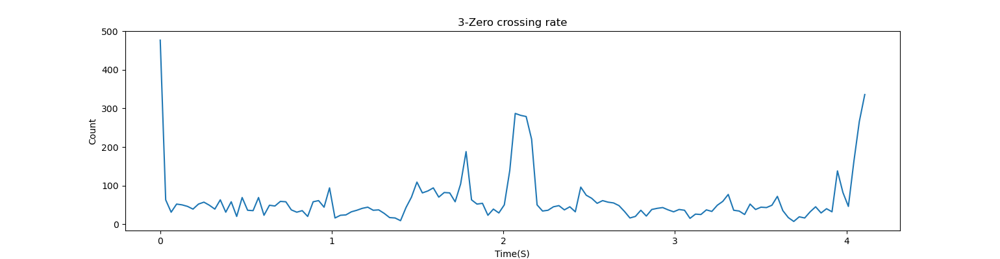

# Speech-Processing
## waveform
將wav音檔(voice.wav)用liborsa套件讀入，接著算出frameSize大小，最後輸出圖檔

## Energy Contour
將frameSize大小及原始音檔傳入function中，我假設window為rect window且overlap的部分為0，之後從第一個frame到最後一個frame，
算出每個frame的energy(將每個frame中的點的數值取平方，之後相加)，最後再畫出來即可

## Zero-crossing rate contour
將frameSize大小及原始音檔傳入function中，我假設window為rect window且overlap的部分為0，之後從第一個frame到最後一個frame，
算出每個frame的zero crosssing次數(利用frame中前後兩取樣點相乘是否小於等於0判斷)，最後再畫出來即可

## End point detection
將wave檔，先前算出的zcr跟energy陣列傳入function，而ITU設定為energy陣列的平均值，ITL的取得則是將前五個frame的energy取平均後，再跟先前算出的ITU取平均，IZCT則設定成前五個frame的zcr平均，而zcr的篩選門檻為三倍的IZCT，這樣前處理就結束，之後分別三個階段的篩選，最後得到端點的frame。

## Pitch contour
將wav檔及frameSize傳入，開始做autocorrelation，做完之後做gaussian_filter，使曲線較平滑(防止找錯波峰)，之後取出所有的local maximun並將位置存在peaks中，當peaks的元素小於兩個或者該frame的energy小於threshold值，將此frame的頻率設為0，之後開始選擇波峰值，因為有可能出現假波峰值，所以將autocorrelation的值做排序，之後選擇最大值和第二大值且在peaks中的採樣點作為第一個波峰位置和第二個波峰，最後因為人的發聲頻率在40到1000赫茲，於是當算出頻率不在此範圍時，將頻率設為0，最後一步再做median5 smoothing即完成。

